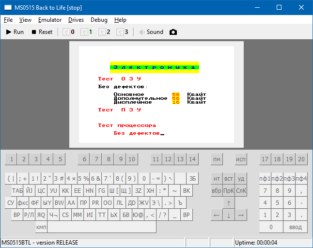
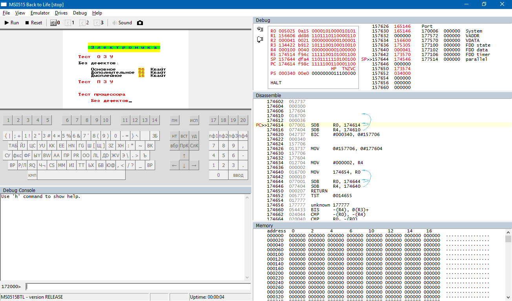
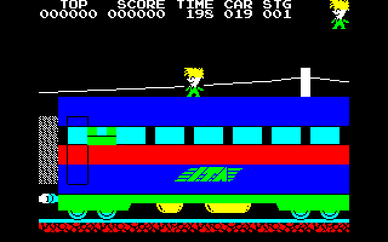
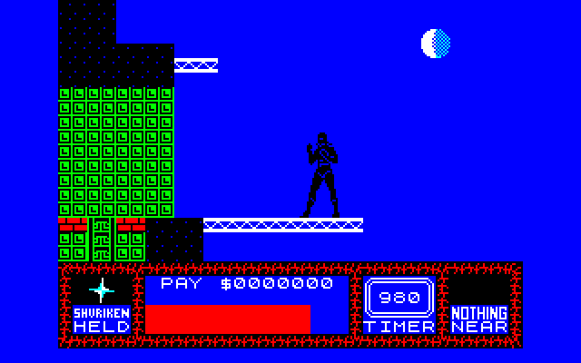

# ms0515btl
**MS0515 Back to Life!** is emulator of **Elektronika MS 0515** (**Электроника МС 0515**), soviet computer based on PDP-11 compatible processor.

#### Screenshots

The emulator in Debug mode:

"Stop the Express" game, ported from ZX Spectrum:

"Saboteur 2" game, ported from ZX Spectrum:

#### See Also
* [Электроника МС0515](https://ru.wikipedia.org/wiki/%D0%AD%D0%BB%D0%B5%D0%BA%D1%82%D1%80%D0%BE%D0%BD%D0%B8%D0%BA%D0%B0_%D0%9C%D0%A1_0515) в Википедии
* [МС-0515](http://zx-pk.ru/threads/15146-ms-0515.html) — тема по МС-0515 на zx-pk.ru
* [Электроника МС0515](http://www.emuverse.ru/wiki/%D0%AD%D0%BB%D0%B5%D0%BA%D1%82%D1%80%D0%BE%D0%BD%D0%B8%D0%BA%D0%B0_%D0%9C%D0%A10515) — описание МС0515 на Emuverse.ru
